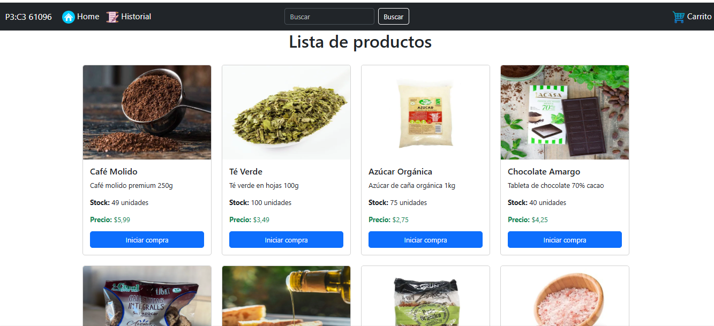
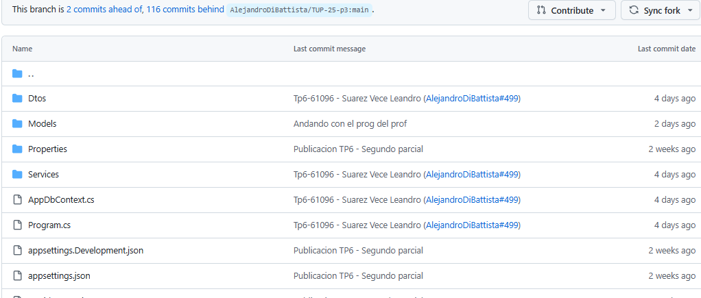

# Home

# Mi caso particular

Hola profe, le queria comentar lo que me sucedio hoy, que me di cuenta solo al volver. Hoy cuando mire que estaba en la lista, me di cuenta que tenia esta carpeta que borre, por sugerencia de la IA para tener la carpeta con el nombre correcto para evitar errores en otras SO. El problema es que el dia de hoy 19/6/2025, mas o menos a las 9 alguien hizo un merge, pero que tenia mi archivo viejo, el cual tenia una clase llamada producto, con el mismo nameespace que daba problema. yo pense que era mi error, pero cuando volvi, me di cuenta que no era mio sino del merge.

Qqui dejo las imagenes y un link al [Repositorio TP6 - Servidor](https://github.com/leandroVece/TUP-25-p3/tree/TP6-61096-corregido/TP/61096%20-%20Suarez%20Vece%2C%20Leandro%20Andres/tp6/servidor), para que lo comente en "casos interesantes que suceden cuando no se hace bien las cosas" una buena anecdota, que me saco un grito 

